# Social Pulse - Comprehensive Architecture Documentation

## Table of Contents
1. [System Overview](#system-overview)
2. [Architecture Diagrams](#architecture-diagrams)
3. [Technology Stack](#technology-stack)
4. [Component Architecture](#component-architecture)
5. [Data Flow Patterns](#data-flow-patterns)
6. [API Documentation](#api-documentation)
7. [Performance Optimizations](#performance-optimizations)
8. [Security Architecture](#security-architecture)
9. [Pros and Cons Analysis](#pros-and-cons-analysis)
10. [Deployment Architecture](#deployment-architecture)

---

## System Overview

Social Pulse is a modern, sentiment-aware social media platform built with a **multi-service architecture** combining:
- **Rust backend** (Axum framework) for high-performance API services
- **Python microservice** for AI/ML sentiment analysis and content moderation
- **Vanilla JavaScript frontend** with advanced caching and real-time interactions
- **PostgreSQL database** for reliable data persistence
- **AI-powered content analysis** using HuggingFace models

### Key Features
- ✅ Real-time sentiment analysis on posts and comments
- ✅ Reddit-style hierarchical comment system with infinite nesting
- ✅ Advanced client-side caching with LRU memory management
- ✅ Optimistic UI updates for instant user feedback
- ✅ Content moderation with toxicity detection
- ✅ Vote/emotion system for user engagement
- ✅ Mobile-friendly responsive design
- ✅ Swipe-based navigation (Facebook/Reddit style)

### Implementation Status
- ✅ **Fully Implemented:** Core CRUD operations, sentiment analysis, comment threading, caching, authentication
- 🚧 **Partially Implemented:** Rate limiting (planned), compression (planned), advanced deployment configs
- 📋 **Planned Features:** Real-time notifications, advanced recommendation algorithms

---

## Architecture Diagrams

### 1. High-Level System Architecture

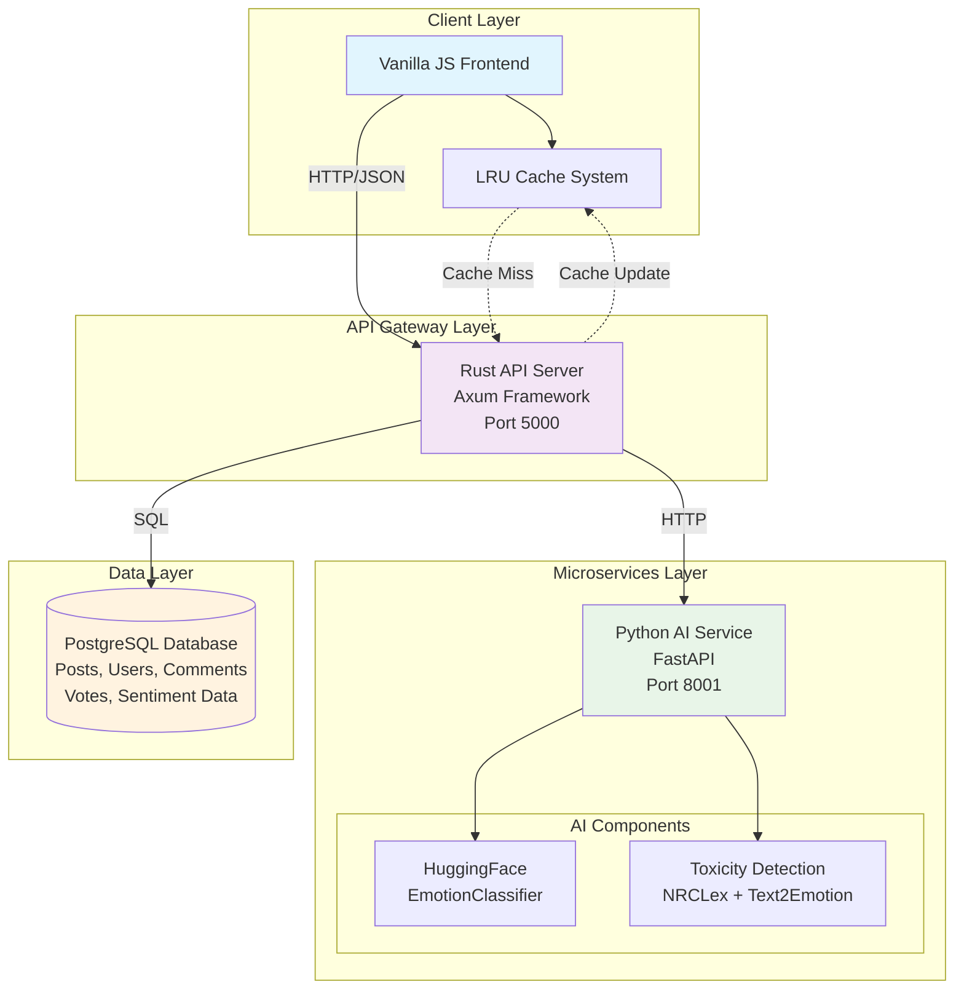

### 2. Request Flow Architecture

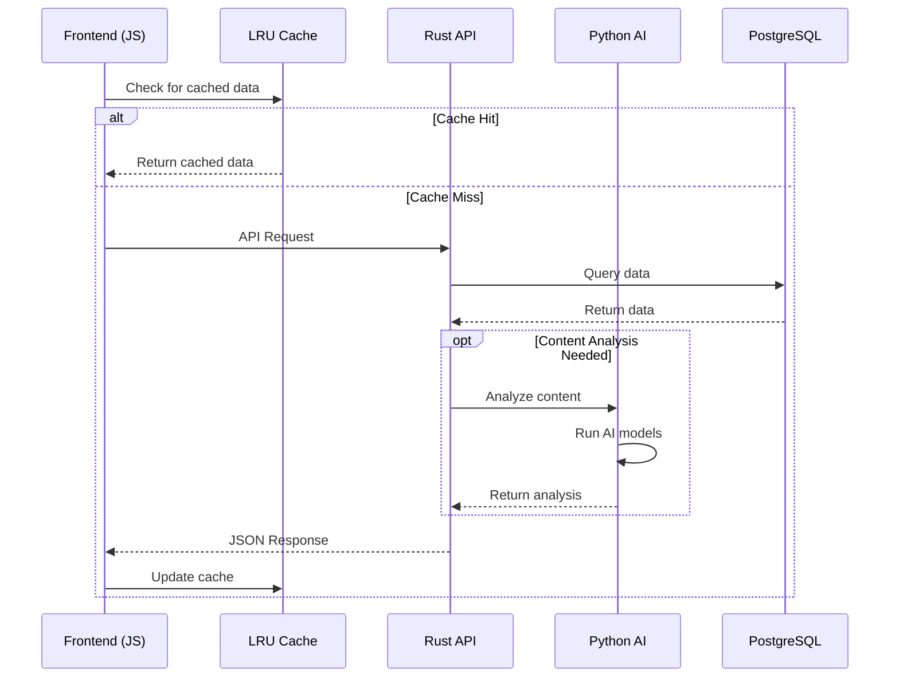

### 3. Component Interaction Diagram

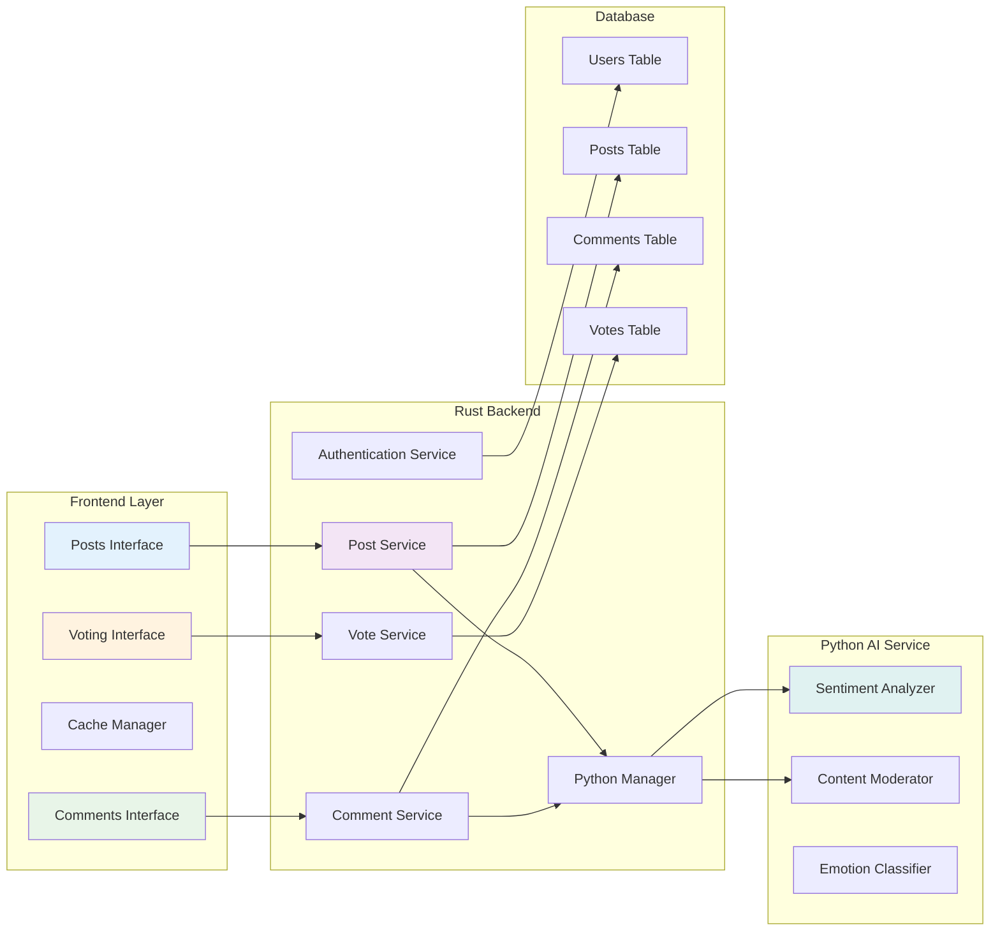

---

## Technology Stack

### Backend Technologies

#### Rust (Primary Backend)
**Framework:** Axum  
**Purpose:** High-performance API server, business logic, and data management

**Key Libraries:**
- `axum` - Modern async web framework
- `tokio` - Async runtime for concurrent operations
- `sqlx` - Type-safe SQL database interactions
- `serde` - Serialization/deserialization for JSON APIs
- `jsonwebtoken` - JWT authentication
- `argon2` - Secure password hashing
- `chrono` - Date/time handling
- `uuid` - Unique identifier generation

#### Python (AI Microservice)
**Framework:** FastAPI  
**Purpose:** Sentiment analysis and content moderation

**Key Libraries:**
- `fastapi` - Modern web framework for APIs
- `uvicorn` - ASGI server for production
- `transformers` - HuggingFace model integration
- `torch` - Deep learning framework
- `nrclex` - Emotion lexicon analysis
- `text2emotion` - Text emotion detection
- `numpy` - Numerical computing
- `scikit-learn` - Machine learning utilities

### Frontend Technologies

#### Vanilla JavaScript
**Purpose:** Client-side application with modern features

**Key Features:**
- ES6+ modern JavaScript
- Fetch API for HTTP requests
- LocalStorage for session management
- CSS Grid and Flexbox for layout
- Progressive Web App capabilities

#### Caching System
**Custom LRU Implementation:**
- Memory-efficient caching
- Automatic cleanup and expiration
- Optimistic updates
- Cache invalidation strategies

### Database

#### PostgreSQL
**Purpose:** Primary data persistence layer

**Schema Design:**
- Users table with authentication data
- Posts table with sentiment metadata
- Comments table with hierarchical threading
- Votes table for user engagement
- Indexes for performance optimization

---

## Component Architecture

### MVC Architecture Pattern

#### Models (Data Layer)

**Rust Models (`src/models/`):**

```mermaid
classDiagram
    class User {
        +Uuid id
        +String username
        +String email
        +String password_hash
        +DateTime created_at
        +DateTime updated_at
    }

    class Post {
        +Uuid id
        +Uuid user_id
        +String content
        +Option~f64~ sentiment_score
        +Vec~String~ sentiment_colors
        +Option~String~ sentiment_type
        +bool is_blocked
        +Vec~String~ toxicity_tags
        +i32 vote_count
        +f64 popularity_score
        +DateTime created_at
        +DateTime updated_at
    }

    class Comment {
        +Uuid id
        +Uuid post_id
        +Uuid user_id
        +Option~Uuid~ parent_id
        +String content
        +String path
        +i32 depth
        +Option~f64~ sentiment_score
        +Vec~String~ sentiment_colors
        +Option~String~ sentiment_type
        +bool is_blocked
        +i32 reply_count
        +f64 popularity_score
        +DateTime created_at
        +DateTime updated_at
    }

    class Vote {
        +Uuid id
        +Uuid user_id
        +Uuid target_id
        +String target_type
        +String vote_type
        +String emotion_tag
        +DateTime created_at
    }

    User ||--o{ Post : creates
    User ||--o{ Comment : writes
    User ||--o{ Vote : casts
    Post ||--o{ Comment : contains
    Comment ||--o{ Comment : replies_to
```

#### Controllers (Service Layer)

**Rust Services (`src/services/`):**

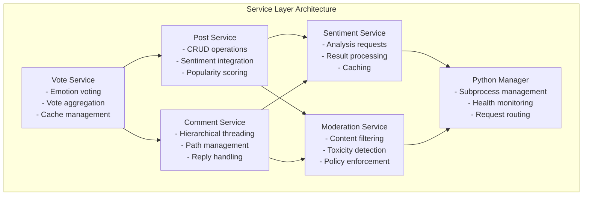

#### Views (Presentation Layer)

**JavaScript Frontend Architecture:**

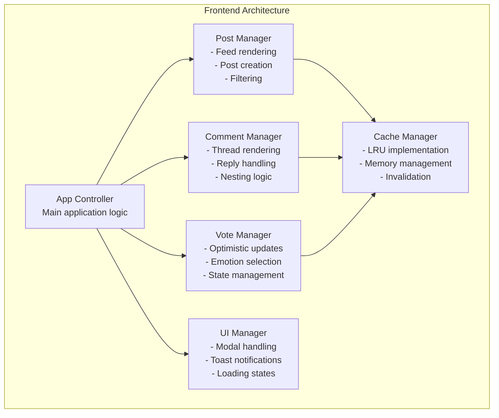

---

## Data Flow Patterns

### 1. Post Creation Flow

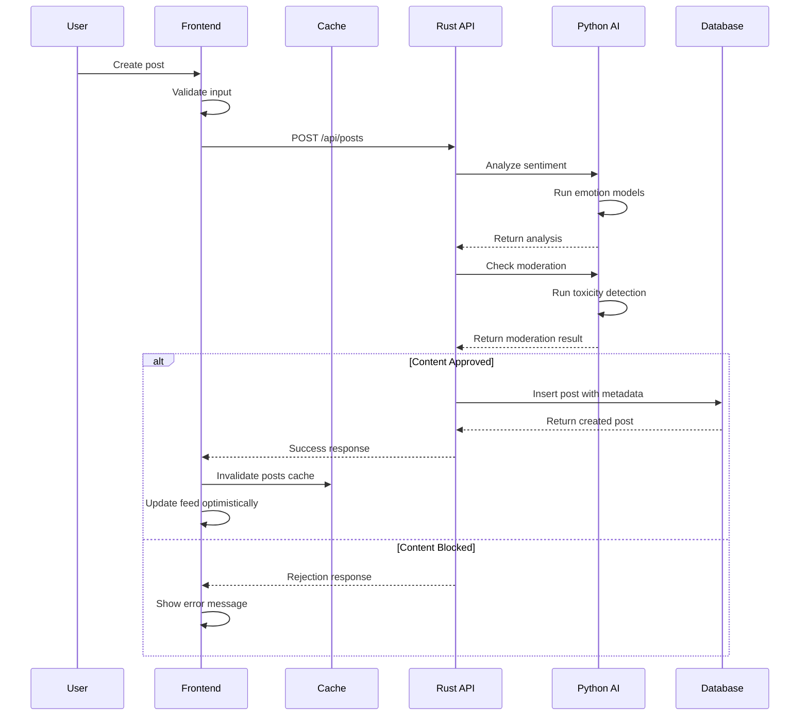

### 2. Comment Thread Loading

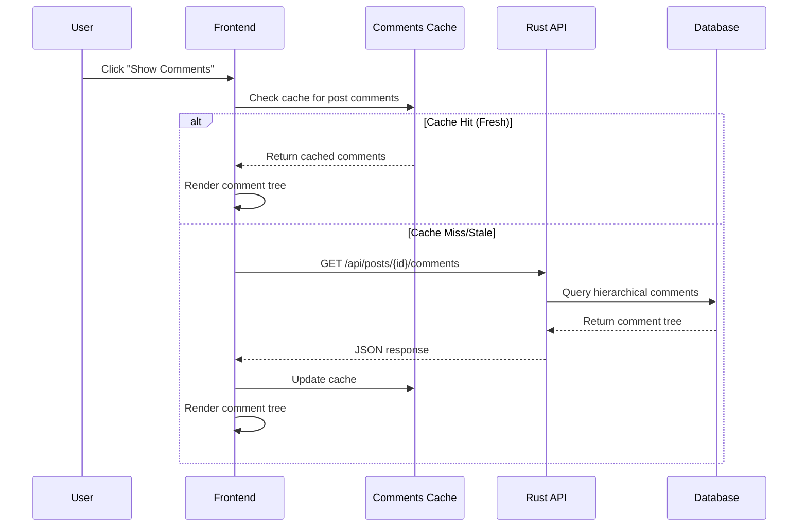

### 3. Voting System Flow

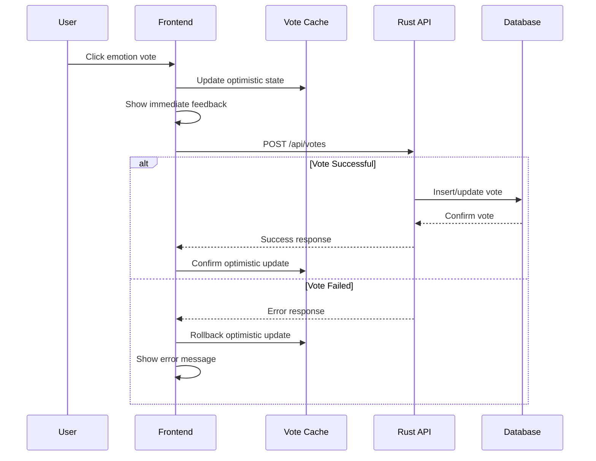

---

## API Documentation

### Authentication Endpoints

| Method | Endpoint | Purpose | Auth Required |
|--------|----------|---------|---------------|
| POST | `/api/auth/register` | User registration | No |
| POST | `/api/auth/login` | User login | No |
| GET | `/api/auth/verify` | Token verification | Yes |

### Posts Endpoints

| Method | Endpoint | Purpose | Auth Required |
|--------|----------|---------|---------------|
| GET | `/api/posts` | Get paginated posts | No |
| POST | `/api/posts` | Create new post | Yes |
| GET | `/api/posts/{id}` | Get specific post | No |
| PUT | `/api/posts/{id}` | Update post | Yes (owner) |
| DELETE | `/api/posts/{id}` | Delete post | Yes (owner) |

### Comments Endpoints

| Method | Endpoint | Purpose | Auth Required |
|--------|----------|---------|---------------|
| GET | `/api/posts/{id}/comments` | Get post comments | No |
| POST | `/api/posts/{id}/comments` | Create comment | Yes |
| GET | `/api/comments/{id}` | Get specific comment | No |
| PUT | `/api/comments/{id}` | Update comment | Yes (owner) |
| DELETE | `/api/comments/{id}` | Delete comment | Yes (owner) |

### Voting Endpoints

| Method | Endpoint | Purpose | Auth Required |
|--------|----------|---------|---------------|
| POST | `/api/votes` | Cast vote/emotion | Yes |
| GET | `/api/votes/{target_id}` | Get vote summary | No |
| DELETE | `/api/votes/{id}` | Remove vote | Yes (owner) |

---

## Performance Optimizations

### 1. Caching Strategy

#### Frontend Caching
- **LRU Cache Implementation:** Intelligent memory management
- **Cache Partitioning:** Separate caches for posts, comments, votes
- **Staleness Detection:** Time-based cache invalidation
- **Optimistic Updates:** Immediate UI feedback with rollback capability

#### Backend Caching
- **Database Connection Pooling:** Efficient connection reuse ✅ (implemented)
- **Query Optimization:** Indexed lookups and prepared statements ✅ (implemented)
- **Result Caching:** Cache frequent database queries (planned)

### 2. Database Performance

#### Indexing Strategy
```sql
-- Optimized indexes for common queries
CREATE INDEX idx_posts_created_at ON posts(created_at DESC);
CREATE INDEX idx_posts_popularity ON posts(popularity_score DESC);
CREATE INDEX idx_comments_post_id ON comments(post_id);
CREATE INDEX idx_comments_path ON comments(path);
CREATE INDEX idx_votes_target ON votes(target_id, target_type);
```

#### Hierarchical Comments
- **Materialized Path Pattern:** Efficient tree traversal
- **Atomic Path Generation:** Consistent threading
- **Batch Loading:** Reduce N+1 query problems

### 3. Network Optimization

#### Request Batching
- **Bulk Operations:** Multiple votes/comments in single request (planned)
- **Pagination:** Controlled data loading ✅ (implemented)
- **Compression:** Gzip compression for JSON responses (planned)

#### Connection Management
- **HTTP/2:** Multiplexed connections (depends on deployment)
- **Keep-Alive:** Persistent connections ✅ (implemented via Axum)
- **Connection Pooling:** Database connection pooling ✅ (implemented via SQLx)

---

## Security Architecture

### 1. Authentication & Authorization

#### JWT Token System
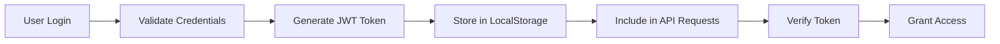

#### Security Measures
- **Argon2 Password Hashing:** Industry-standard password security
- **Token Expiration:** Time-limited session tokens
- **CORS Protection:** Cross-origin request filtering
- **Rate Limiting:** Prevent abuse and DoS attacks (planned)

### 2. Content Security

#### Input Validation
- **XSS Prevention:** HTML escaping for all user content
- **SQL Injection Protection:** Parameterized queries
- **Content Length Limits:** Prevent oversized inputs
- **Character Encoding:** UTF-8 validation

#### AI-Powered Moderation
- **Toxicity Detection:** Automatic content filtering
- **Sentiment Analysis:** Emotion-based content categorization
- **Real-time Processing:** Immediate content analysis

### 3. Data Protection

#### Database Security
- **Encrypted Connections:** TLS for database communications (recommended for production)
- **Access Controls:** Role-based database permissions
- **Audit Logging:** Track data access and modifications
- **Backup Encryption:** Secure data backups

---

## Pros and Cons Analysis

### Technology Choices

#### Rust Backend

**Pros:**
✅ **Memory Safety:** Zero-cost abstractions prevent common bugs  
✅ **Performance:** Near C++ performance with safety guarantees  
✅ **Concurrency:** Excellent async/await support with Tokio  
✅ **Type Safety:** Compile-time error detection  
✅ **Ecosystem:** Growing ecosystem with quality crates  
✅ **Future-Proof:** Systems programming language with longevity  

**Cons:**
❌ **Learning Curve:** Steep learning curve for new developers  
❌ **Compilation Time:** Slower builds compared to interpreted languages  
❌ **Ecosystem Maturity:** Some libraries still in development  
❌ **Developer Pool:** Smaller pool of experienced Rust developers  

#### Python AI Service

**Pros:**
✅ **AI/ML Ecosystem:** Unmatched library support for machine learning  
✅ **Rapid Development:** Quick prototyping and iteration  
✅ **Model Availability:** Easy access to pre-trained models  
✅ **Community:** Large community and extensive documentation  
✅ **Integration:** Seamless integration with HuggingFace and PyTorch  

**Cons:**
❌ **Performance:** Slower execution compared to compiled languages  
❌ **Memory Usage:** Higher memory consumption  
❌ **GIL Limitations:** Global Interpreter Lock limits true parallelism  
❌ **Deployment:** More complex deployment requirements  

#### Vanilla JavaScript Frontend

**Pros:**
✅ **No Build Step:** Direct browser execution  
✅ **Performance:** No framework overhead  
✅ **Control:** Complete control over DOM manipulation  
✅ **Simplicity:** Easier debugging and maintenance  
✅ **Bundle Size:** Minimal JavaScript payload  

**Cons:**
❌ **Development Speed:** Slower development compared to frameworks  
❌ **Code Organization:** More effort required for large applications  
❌ **Browser Compatibility:** Manual handling of browser differences  
❌ **State Management:** Manual state synchronization  

#### PostgreSQL Database

**Pros:**
✅ **ACID Compliance:** Strong consistency guarantees  
✅ **Performance:** Excellent query optimization  
✅ **Features:** Rich feature set including JSON support  
✅ **Reliability:** Proven reliability in production  
✅ **Extensions:** Powerful extension ecosystem  

**Cons:**
❌ **Complexity:** More complex setup than simpler databases  
❌ **Resource Usage:** Higher resource requirements  
❌ **Scaling:** Vertical scaling limitations  

### Architecture Decisions

#### Microservices Architecture

**Pros:**
✅ **Separation of Concerns:** Clear service boundaries  
✅ **Technology Diversity:** Use best tool for each job  
✅ **Scalability:** Scale services independently  
✅ **Maintenance:** Easier to maintain and update individual services  

**Cons:**
❌ **Complexity:** Increased system complexity  
❌ **Network Overhead:** Inter-service communication costs  
❌ **Debugging:** More difficult to debug distributed systems  
❌ **Deployment:** More complex deployment pipeline  

#### Client-Side Caching

**Pros:**
✅ **Performance:** Dramatic improvement in perceived performance  
✅ **User Experience:** Instant interactions and feedback  
✅ **Server Load:** Reduced server requests and bandwidth  
✅ **Offline Capability:** Partial offline functionality  

**Cons:**
❌ **Memory Usage:** Increased client-side memory consumption  
❌ **Complexity:** Cache invalidation and consistency challenges  
❌ **Stale Data:** Risk of showing outdated information  

---

## Deployment Architecture

### Production Deployment Strategy

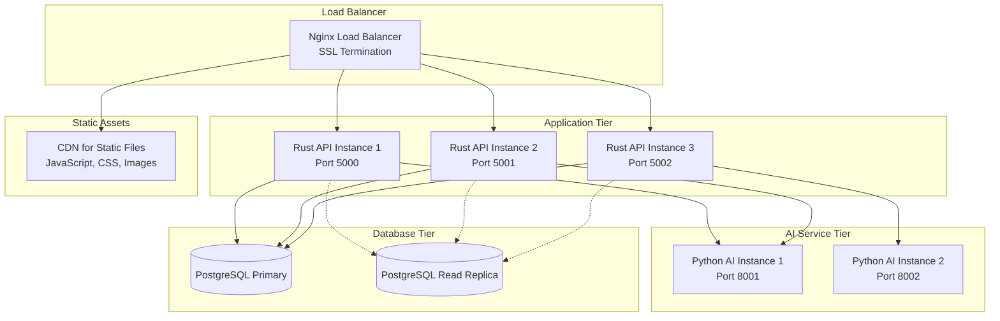

### Container Strategy (Planned Deployment Configuration)

```yaml
# docker-compose.yml structure (example configuration)
services:
  rust-api:
    build: .
    ports: ["5000:5000"]
    environment:
      - DATABASE_URL
      - PYTHON_SERVER_MODE=external
    depends_on: [postgres, python-ai]

  python-ai:
    build: ./python_scripts
    ports: ["8001:8001"]
    environment:
      - MODEL_CACHE_DIR=/models

  postgres:
    image: postgres:15
    environment:
      - POSTGRES_DB=social_media
    volumes:
      - postgres_data:/var/lib/postgresql/data

  nginx:
    image: nginx:alpine
    ports: ["80:80", "443:443"]
    volumes:
      - ./nginx.conf:/etc/nginx/nginx.conf
      - ./static:/usr/share/nginx/html
```

### Monitoring and Observability

#### Metrics Collection
- **Application Metrics:** Request rates, response times, error rates
- **System Metrics:** CPU, memory, disk usage, network I/O
- **Database Metrics:** Query performance, connection pool status
- **Cache Metrics:** Hit rates, memory usage, eviction rates

#### Logging Strategy
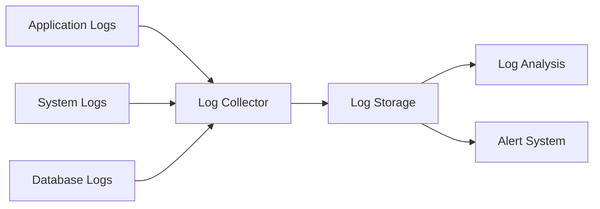

---

## Conclusion

Social Pulse represents a modern, scalable social media platform that leverages cutting-edge technologies to deliver a superior user experience. The architecture balances performance, security, and maintainability while incorporating AI-powered features that set it apart from traditional social platforms.

### Key Achievements
- **Performance:** Sub-second response times with intelligent caching
- **Scalability:** Horizontally scalable microservices architecture
- **Security:** Multi-layered security with AI-powered content moderation
- **User Experience:** Instant feedback with optimistic UI updates
- **Maintainability:** Clean separation of concerns with well-defined APIs

### Future Enhancements
- Real-time notifications with WebSocket support
- Advanced recommendation algorithms
- Multi-language sentiment analysis
- Enhanced content moderation with custom AI models
- Mobile applications with shared API layer

The platform provides a solid foundation for production deployment, with core features implemented and additional optimizations planned for scaling with growing user demands while maintaining excellent performance and security standards.

---

*Documentation Version: 1.0*  
*Last Updated: September 2025*  
*Platform: Social Pulse v1.0*